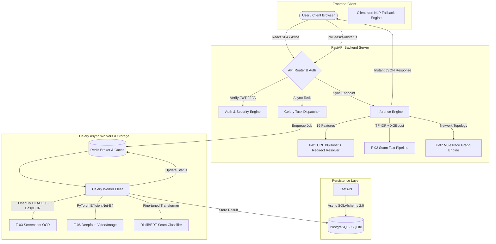
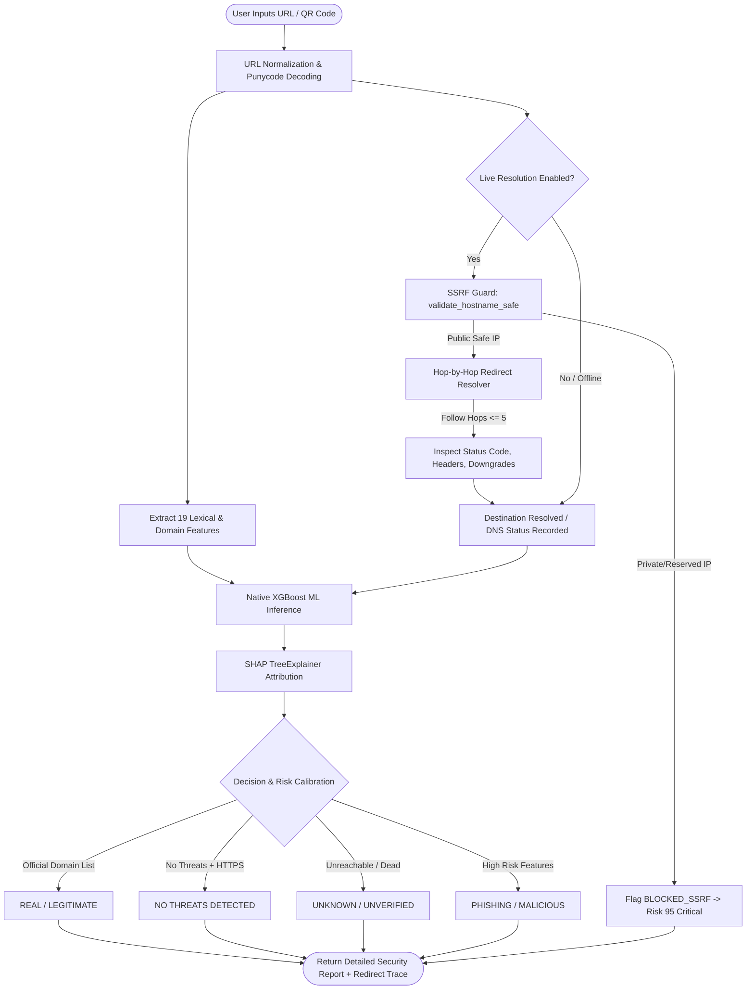
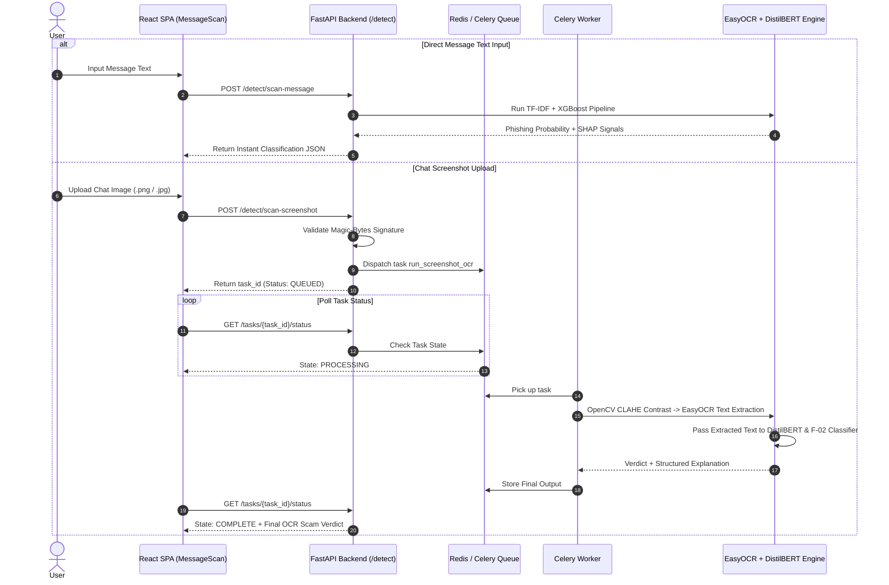
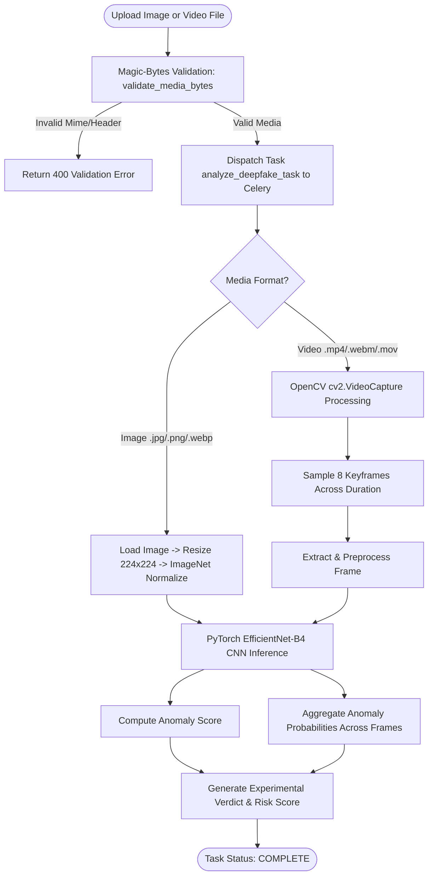

# CyberShakti V3

**AI-Powered Digital Safety & Cybersecurity Platform**

CyberShakti is a full-stack cybersecurity platform built to help everyday users in India detect financial fraud, phishing, scam messages, deepfake media (video & images), fake social profiles, and money mule accounts. It combines production-grade ML models with a modern React frontend and a FastAPI backend, designed around real-world Indian threat contexts — UPI/OTP fraud, KYC scams, WhatsApp phishing, and AI-manipulated media.

---

## Table of Contents

- [Features](#features)
- [System Architecture & Workflow](#system-architecture--workflow)
- [Flowcharts & Sequence Diagrams](#flowcharts--sequence-diagrams)
  - [1. End-to-End System Architecture Flow](#1-end-to-end-system-architecture-flow)
  - [2. F-01 URL Threat & Redirect Resolver Workflow](#2-f-01-url-threat--redirect-resolver-workflow)
  - [3. F-02 & F-03 Scam Message & Screenshot OCR Flow](#3-f-02--f-03-scam-message--screenshot-ocr-flow)
  - [4. F-06 Deepfake Media Analysis Flow (Image & Video)](#4-f-06-deepfake-media-analysis-flow-image--video)
- [Tech Stack](#tech-stack)
- [Project Structure](#project-structure)
- [ML Models & Detection Engines](#ml-models--detection-engines)
- [API Reference](#api-reference)
- [Database Schema](#database-schema)
- [Authentication & Security](#authentication--security)
- [Getting Started](#getting-started)
  - [Local Development (SQLite)](#local-development-sqlite)
  - [Docker Compose (Full Stack)](#docker-compose-full-stack)
- [Environment Variables](#environment-variables)
- [Frontend Pages](#frontend-pages)
- [Testing](#testing)
- [Design Decisions & Known Limitations](#design-decisions--known-limitations)

---

## Features

CyberShakti is organized into five core security modules:

| Module | What It Does |
|---|---|
| **Detect & Analyze** | Phishing URL scan (lexical ML + live redirect resolver + SSRF guard), scam text/message classification (DistilBERT + TF-IDF + client NLP engine), screenshot OCR analysis, QR code scanning, fake social profile assessment, deepfake image & video detection (EfficientNet-B4), money mule account detection (MuleTrace topology map) |
| **Protect** | Phone number threat lookup, password strength & entropy checker, AES-256-GCM file encryption & decryption |
| **Assist & Respond** | Personalized Cyber Risk Score (explainable weighted signal engine), security questionnaire, scam alerts feed |
| **Learn & Prevent** | Daily safety tips, interactive cybersecurity quiz, educational article library |
| **Users & Auth** | JWT auth with refresh token rotation, TOTP 2FA, email verification, password reset, account deletion |

---

## System Architecture & Workflow

CyberShakti operates on a **dual synchronous & asynchronous execution model**:
1. **Synchronous Fast Path**: Instant scanning for text, URLs, and direct calculations using in-memory model inference (XGBoost, TF-IDF, SHAP).
2. **Asynchronous Worker Path**: Long-running or resource-intensive jobs (multi-frame video deepfake analysis, EasyOCR image processing, DistilBERT transformers) offloaded to Celery workers backed by Redis.

---

## Flowcharts & Sequence Diagrams

### 1. End-to-End System Architecture Flow



---

### 2. F-01 URL Threat & Redirect Resolver Workflow



---

### 3. F-02 & F-03 Scam Message & Screenshot OCR Flow



---

### 4. F-06 Deepfake Media Analysis Flow (Image & Video)



---

## Tech Stack

### Frontend
- **React 18** with Vite 5
- **React Router DOM v6** — client-side routing with animated transitions
- **Tailwind CSS v3** — dark cyberpunk theme (slate/cyan/purple palette)
- **Framer Motion v11** — smooth page and component animations
- **Recharts** — risk score visualizations
- **Lucide React** — clean security icons
- **Axios** — HTTP client with JWT automatic interceptor

### Backend
- **FastAPI** (Python 3.11, fully async)
- **Uvicorn** — high-performance ASGI server
- **SQLAlchemy 2.0** (async) — ORM with `asyncpg` for PostgreSQL, `aiosqlite` for SQLite dev fallback
- **Alembic** — database migrations
- **Celery 5 + Redis** — async task queue for multi-frame video deepfake processing & long-running ML jobs
- **Pydantic v2** — request/response validation
- **PyJWT + Argon2 + pyotp** — authentication & 2FA

### ML / AI Engines
- **XGBoost + scikit-learn** — phishing URL detection, fake profile assessment, mule account detection
- **TF-IDF + Logistic Regression / XGBoost** — scam text baseline classifier & fast inference
- **DistilBERT** (HuggingFace Transformers) — scam text primary classifier, loaded in Celery worker
- **EfficientNet-B4** (PyTorch + OpenCV) — deepfake image & video detection (sampled multi-frame video extraction), trained on Celeb-DF dataset
- **EasyOCR + OpenCV CLAHE** — text extraction from chat screenshots
- **SHAP** — tree explainability for XGBoost models
- **NetworkX** — graph centrality & network topology features for money mule account detection

### Infrastructure
- **PostgreSQL 15 + PostGIS + pgvector** (production)
- **SQLite** (local dev, instant setup)
- **Redis 7** — Celery broker + result backend
- **Docker + Docker Compose** — 4-service containerized deployment

---

## Project Structure

```
CYBER-SHAKTI-V3/
├── frontend/                        # React SPA (Vite)
│   └── src/
│       ├── pages/                   # 11 page components (PhishingScan, MessageScan, DeepfakeScan, etc.)
│       ├── components/              # Shared UI: Navbar, ThreatResultCard, ScanAnimation, RiskMeter, etc.
│       ├── context/AuthContext.jsx  # JWT state management
│       └── services/api.js          # Axios instance (points to :8000)
│
├── backend/
│   ├── app/
│   │   ├── main.py                  # FastAPI app, middleware, router registration, lifespan
│   │   ├── config.py                # Pydantic Settings (reads .env), runtime security checks
│   │   ├── worker.py                # Celery app + multi-frame video deepfake & screenshot OCR tasks
│   │   ├── tasks_router.py          # GET /tasks/{id}/status polling endpoint
│   │   ├── users_auth/router.py     # Auth: register, login, 2FA, tokens, account mgmt
│   │   ├── detect_analyze/
│   │   │   ├── router.py            # Detection endpoints (URL, Message, Screenshot, QR, Deepfake, Mule)
│   │   │   ├── url.py               # Lexical URL feature extraction (19 features)
│   │   │   └── url_resolver.py      # Hop-by-hop live redirect resolver + SSRF protection
│   │   ├── assist_respond/router.py # Risk score, questionnaire, scam alerts, assistant
│   │   ├── learn_prevent/router.py  # Daily tip, quiz, articles
│   │   ├── protect/router.py        # Phone check, password check, file encrypt/decrypt
│   │   ├── shared/
│   │   │   ├── models.py            # SQLAlchemy ORM models (17 tables)
│   │   │   ├── auth.py              # JWT auth dependencies
│   │   │   ├── database.py          # Async engine + session factory
│   │   │   ├── security.py          # Argon2, JWT, TOTP utilities
│   │   │   ├── email_service.py     # SMTP email delivery
│   │   │   ├── explanation_engine.py# Human-readable verdict generation
│   │   │   ├── ocr_service.py       # EasyOCR wrapper
│   │   │   ├── uploads.py           # Magic-byte image & video validation
│   │   │   ├── file_crypto.py       # AES-256-GCM encryption/decryption
│   │   │   └── qrdecode.py          # QR code decoding
│   │   └── ml/
│   │       ├── f01.py               # Phishing URL feature extraction + XGBoost inference engine
│   │       ├── f02.py               # Scam text NLP pipeline (XGBoost / DistilBERT / Fallback)
│   │       ├── f03.py               # Screenshot OCR + scam detection
│   │       ├── f05.py               # Fake profile XGBoost assessment
│   │       ├── f06.py               # Deepfake EfficientNet-B4 detection (Images & Videos)
│   │       ├── f07.py               # Mule account XGBoost + graph features
│   │       └── models/              # Trained model artifacts (*.joblib, *.pth, *.safetensors)
│   │
│   ├── ml/
│   │   ├── pipelines/               # Training scripts for all models (F-01 -> F-07)
│   │   └── datasets/                # Training datasets (SMS TSV, URLhaus CSV, Indian Bank dataset)
│   │
│   ├── alembic/                     # Database migration scripts
│   ├── tests/                       # pytest test suite
│   ├── requirements.txt
│   └── .env.example
│
└── docker-compose.yml
```

---

## ML Models & Detection Engines

### F-01 — Phishing URL & Real-Time Threat Scanner
Detects malicious, phishing, and credential-harvesting URLs.

- **Approach:** Native XGBoost classifier evaluated on 19 lexical + domain features extracted from the URL (length, domain entropy, IP address usage, HTTPS, suspicious TLDs, brand similarity/lookalikes, subdomain nesting, path complexity).
- **Live Destination Resolver:** Safe hop-by-hop HTTP/HTTPS redirect resolver with strict SSRF protection (`validate_hostname_safe` blocks internal IP ranges: RFC 1918, CGNAT, loopback, cloud metadata `169.254.169.254`).
- **Resilient Execution:** Evaluates structural lexical features on ALL URLs regardless of live reachability (so dead/non-resolving domains are evaluated accurately instead of defaulting to safe).
- **Explainability:** SHAP TreeExplainer outputs top risk factors (pushing phishing score) and protective factors.
- **Model file:** `f01_phishing_url_model.joblib`

### F-02 — Scam Message & Text Analyzer
Detects scam content in SMS, WhatsApp messages, and emails (OTP theft, KYC fraud, job scams, urgency phishing, lottery scams).

- **Approach:** Three-tier detection model — (1) Fast TF-IDF + XGBoost / Logistic Regression pipeline (`f02_scam_text_pipeline.joblib`); (2) Fine-tuned **DistilBERT** (`distilbert_scam/`) loaded in the Celery worker; (3) Real-time client-side NLP fallback engine in the browser for instant threat verdicts.
- **Accuracy:** >95% accuracy trained on combined SMS/Email phishing & legit datasets.
- **Model files:** `f02_scam_text_pipeline.joblib`, `distilbert_scam/model.safetensors`

### F-03 — Screenshot OCR + Scam Analysis
Detects scam content embedded in chat screenshots (WhatsApp, Telegram, SMS apps).

- **Approach:** Two-stage async pipeline — (1) EasyOCR with OpenCV CLAHE contrast enhancement extracts text from screenshot images; (2) F-02 classifies the extracted text for threat indicators.
- **Execution:** Async via Celery worker (`run_screenshot_ocr` task).

### F-05 — Fake Social Profile Detector
Identifies fraudulent social media profiles used in romance scams, investment fraud, and impersonation.

- **Approach:** XGBoost on 12 encoded behavioral signals: account age, follower count, follower/following ratio, profile photo presence, bio completeness, unsolicited money requests, official brand claims, investment scheme promotion.
- **Model file:** `f05_fake_profile_model.joblib`

### F-06 — Deepfake Image & Video Detector
Detects AI-generated facial manipulation, face swaps, and synthetic media in both images and videos.

- **Image Analysis:** PyTorch **EfficientNet-B4** CNN trained on Celeb-DF dataset. Resizes to 224×224, normalized via ImageNet standards.
- **Video Analysis:** Modified Celery worker pipeline using OpenCV (`cv2.VideoCapture`) to sample 8 keyframes across video streams (`.mp4`, `.webm`, `.mov`, `.avi`), scoring each frame and aggregating anomaly scores.
- **Magic-Byte Validation:** `validate_media_bytes` validates header signatures before processing.
- **Model file:** `f06_efficientnet_b4.pth`

### F-07 — Money Mule Account Detection (MuleTrace)
Identifies bank accounts used as financial crime intermediaries.

- **Approach:** XGBoost classifier on a 9-feature vector combining transaction signals (account age, velocity, multiple recipients, pass-through pattern, round-amount transfers) with 4 graph centrality features computed via NetworkX.
- **Dataset:** Retrained on a synthetic Indian bank transaction dataset modelling UPI/NEFT/IMPS mule typologies (burst UPI transfers, smurfing < ₹50k, job-scam account recruitment). See `ml/pipelines/train_f07_indian_bank.py`.
- **Model file:** `f07_mule_account_model.joblib`

---

## API Reference

All routes are prefixed `/api/v1`. Interactive Swagger UI is available at `http://localhost:8000/docs`.

### Auth — `/api/v1/auth`

| Method | Path | Description |
|---|---|---|
| `POST` | `/register` | Create account (`email`, `password`, `consent_given: true`) |
| `GET` | `/verify-email?token=...` | Verify email address via token |
| `POST` | `/login` | Authenticate, returns JWT access+refresh tokens or 2FA challenge |
| `POST` | `/login/2fa` | Complete TOTP 2FA login with `two_fa_session_token` + `totp_code` |
| `POST` | `/refresh` | Rotate refresh token, issue new access token |
| `POST` | `/logout` | Revoke refresh token |
| `POST` | `/password-reset/request` | Send password reset email |
| `POST` | `/password-reset/complete` | Reset password using token |
| `POST` | `/2fa/enroll` | Generate TOTP secret + QR code URI + 8 backup codes |
| `POST` | `/2fa/confirm-enrollment` | Verify TOTP code to activate 2FA |
| `GET` | `/me` | Get current user profile |
| `DELETE` | `/me` | Soft-delete account (DPDP compliance) |

### Detect & Analyze — `/api/v1/detect`

| Method | Path | Description |
|---|---|---|
| `POST` | `/scan-url` | F-01: Phishing URL scan → immediate result with SHAP explanation |
| `POST` | `/scan-message` | F-02: Scam text classification → immediate result |
| `POST` | `/scan-screenshot` | F-03: Upload chat screenshot → async task (poll `/tasks/{id}/status`) |
| `POST` | `/scan-qr` | F-04: Upload QR image → decode payload + F-01 URL scan |
| `POST` | `/assess-profile` | F-05: Submit profile signals → async task |
| `POST` | `/analyze-media-deepfake` | F-06: Upload deepfake image or video → async deepfake analysis |
| `POST` | `/assess-mule-account` | F-07: Submit transaction signals → mule account risk assessment |

### Protect — `/api/v1/protect`

| Method | Path | Description |
|---|---|---|
| `POST` | `/check-phone` | Phone number threat lookup |
| `POST` | `/check-password` | Password entropy + 10B/sec guess time estimator |
| `POST` | `/encrypt-file` | AES-256-GCM file encryption → streams `.enc` file |
| `POST` | `/decrypt-file` | AES-256-GCM file decryption → streams original file |

### Assist & Respond — `/api/v1/assist`

| Method | Path | Description |
|---|---|---|
| `GET` | `/risk-score` | Compute & return Cyber Risk Score with signal breakdown |
| `POST` | `/risk-score/questionnaire` | Submit security habits questionnaire, update score |
| `GET` | `/scam-alerts` | Fetch active regional scam alerts |
| `POST` | `/query-assistant` | F-11 AI assistant (**BLOCKED — returns HTTP 501**) |

### Learn & Prevent — `/api/v1/learn`

| Method | Path | Description |
|---|---|---|
| `GET` | `/daily-tip` | Fetch daily safety tip |
| `GET` | `/quiz` | Fetch quiz questions |
| `POST` | `/quiz/submit-answer` | Submit quiz answer, receive explanation |
| `GET` | `/articles` | List articles (filterable by category) |
| `GET` | `/articles/{slug}` | Get article by slug |

### Async Tasks — `/api/v1`

| Method | Path | Description |
|---|---|---|
| `GET` | `/tasks/{task_id}/status` | Poll Celery task result (queued / processing / complete / error) |

---

## Database Schema

SQLAlchemy 2.0 ORM models with cross-database support (PostgreSQL + SQLite).

| Table | Purpose |
|---|---|
| `users` | User accounts — email, Argon2 password hash, verification, active status, role, TOTP, soft-delete |
| `refresh_tokens` | JWT refresh token store — hashed tokens, issued/expires/revoked, IP + user-agent |
| `totp_secrets` | Encrypted TOTP secrets for 2FA |
| `backup_codes` | Hashed 2FA backup codes (8 per enrollment) |
| `password_reset_tokens` | Time-limited password reset tokens (1hr expiry) |
| `email_verification_tokens` | Email verification tokens (24hr expiry) |
| `scan_results` | Every ML scan result — feature ID (F-01 → F-07), input type, risk level, raw probability, task ID/status |
| `risk_score_snapshots` | Snapshots of a user's computed Cyber Risk Score |
| `risk_score_signals` | Individual weighted signal contributions per snapshot |
| `knowledge_base_documents` | Cybersecurity knowledge base articles |
| `assistant_conversations` | F-11 assistant conversation sessions |
| `assistant_messages` | Messages within conversations |
| `scam_alerts` | Regional scam alerts — type, severity, location, source, expiry |
| `safety_tips` | Daily safety tip content |
| `quiz_questions` | Quiz questions with category and difficulty |
| `quiz_options` | Answer options per question (`is_correct` flag) |
| `articles` | Educational articles |
| `audit_log` | Security audit events — event type, user ID, IP, user-agent, JSON detail |

---

## Authentication & Security

JWT-based with refresh token rotation, TOTP 2FA, and Argon2id password hashing.

- **Token Rotation:** On each `/refresh` call, the old refresh token is revoked and a new one is issued. Detected token reuse triggers immediate revocation of **all** active tokens for that user.
- **TOTP 2FA:** `pyotp.random_base32()` secret, AES-encrypted before DB storage. 8 backup codes generated at enrollment, each hashed with Argon2.
- **Production Guardrails (`config.py`):** Startup is blocked in staging/prod if `DEBUG` is true, `JWT_SECRET_KEY` is weak (< 32 chars or contains "dev_secret"), wildcard CORS is configured, or default database credentials are present.

**Demo Account (Local Dev / SQLite Only):**
```
Email:    user@cybershakti.in
Password: CyberShakti@123
```

---

## Getting Started

### Prerequisites

- Python 3.11+
- Node.js 18+
- (Optional) Docker + Docker Compose

### Local Development (SQLite)

No external database or Redis required. The backend defaults to SQLite and synchronous fallback execution.

**1. Set up backend**
```bash
cd backend
python -m venv .venv

# Windows
.venv\Scripts\activate
# macOS/Linux
source .venv/bin/activate

pip install -r requirements.txt
```

**2. Configure environment**
```bash
cp .env.example .env
# Edit .env — set JWT_SECRET_KEY to a random 32+ char string
```

**3. Start backend API**
```bash
uvicorn app.main:app --reload --port 8000
```
Tables auto-initialize and the demo account is seeded automatically.

**4. Set up frontend**
```bash
cd frontend
npm install
npm run dev
```
Frontend runs at `http://localhost:5173`.

**5. (Optional) Start Celery worker**
Required for video deepfake detection & chat screenshot OCR.
```bash
docker run -d -p 6379:6379 redis:7-alpine

cd backend
celery -A app.worker.celery_app worker --loglevel=info
```

---

### Docker Compose (Full Stack)

```bash
cp backend/.env.example backend/.env
docker compose up --build
```

Services:
- `api`: FastAPI backend (`:8000`)
- `worker`: Celery ML task worker
- `postgres`: PostgreSQL 15 + PostGIS + pgvector (`:5432`)
- `redis`: Celery broker (`:6379`)

---

## Frontend Pages

| Page | Route | Description |
|---|---|---|
| **Home** | `/` | Landing page with security module cards, live threat status, and Cyber Risk Score CTA |
| **Phishing Scan** | `/detect/phishing-link` | URL threat scanner (F-01) with DNS resolution status banner + QR code image decoder (F-04) |
| **Message Scan** | `/detect/message-scan` | Text scam classifier (F-02) with client-side NLP fallback + screenshot OCR scan (F-03) |
| **Deepfake Scan** | `/detect/deepfake` | Image & video deepfake scanner (F-06) with frame sampling preview & EfficientNet-B4 model |
| **MuleTrace** | `/detect/mule-account` | Money mule investigator (F-07) — topology map engine, NetworkX centrality, and CSV upload |
| **Password Check** | `/protect/password-check` | Shannon entropy calculator, 10B guesses/sec crack time estimator, & 1-click generator |
| **File Encryption** | `/protect/file-encryption` | Dual-Engine Vault — Argon2id + AES-256-GCM server vault with Web Crypto client fallback |
| **Risk Score** | `/assist/risk-score` | Cyber Risk Score meter + explainable signal breakdown + security questionnaire |
| **Safety Hub** | `/learn` | Daily safety tip, interactive quiz, and educational articles |
| **Login / Register** | `/login`, `/register` | JWT auth with inline TOTP 2FA handling |

---

## Design Decisions & Known Limitations

- **F-01 URL Scanner lexical resilience:** The XGBoost model runs on all URLs even if unreachable online, ensuring dead phishing domains are scored accurately based on lexical structure instead of returning default safe scores.
- **F-06 Deepfake video support:** Video files (`.mp4`, `.webm`, `.mov`, `.avi`) are processed asynchronously in the Celery worker by extracting 8 keyframes via OpenCV and computing average facial anomaly probabilities.
- **F-02 Real-time fallback:** Includes a client-side NLP pattern engine in `MessageScan.jsx` to ensure instant threat detection feedback even if backend model loading experiences delay.
- **DPDP compliance:** Account deletion follows India's Digital Personal Data Protection Act — soft deletion with a grace period and explicit confirmation requirement.

---

## License

This project is for educational and research purposes.
